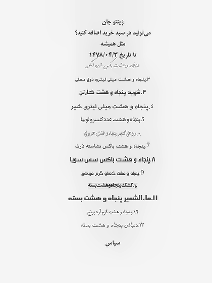

# Synthetic Order List OCR Dataset Generator

A synthetic order list (لیست سفارش) data generator specifically designed for training Persian OCR models. This tool produces realistic, receipt-like documents with corresponding text labels, optimized for vision-language and OCR model training. The generated content includes randomized products, units, amounts, and additional textual phrases such as "لطفا ارسال کنید" or "با تشکر", creating diverse examples for robust Persian OCR training.

## Overview

Training accurate Persian OCR systems requires large, diverse, and annotated datasets that capture real-world variations in text, layout, and document appearance. Real order lists or receipts are often scarce or sensitive. This generator addresses this limitation by synthesizing order documents with controlled randomness, including:

Randomly selected products

Random units and amounts (may not be realistic)

Multiple fonts and typographic styles

Additional external phrases common in orders ("لطفا ارسال کنید", "با تشکر", etc.)

By providing fully annotated synthetic documents, this tool enables scalable training of OCR models for Persian text recognition, even when real data is limited or unavailable.

## Key Features

Persian-language focused – Primary support for Persian (Farsi) script with mixed numeric and English content.

Synthetic order simulation – Generates lists mimicking real order documents (لیست سفارش).

Visual diversity – Randomized fonts, colors, background textures, and geometric transformations.

Text augmentation – Adds realistic contextual phrases common in orders to improve OCR robustness.

Controlled distortions – Applies warping, noise, and preprocessing to simulate real-world document degradation.

Orientation support – Supports 0°, ±90°, and 180° rotations for orientation-robust training.

Training-ready format – Provides PyTorch Dataset and collator implementations compatible with vision-language pipelines.

OCR compatibility – Designed to integrate with Persian OCR training frameworks.

## Technical Architecture

### Layout Generation

Dynamically positions receipt elements (headers, item lists, totals, footers)

Implements column-based formatting for multi-item receipts

Supports variable-length content with proportional spacing

### Text Synthesis

Combines Persian product names, English technical terms, and numeric values

Implements proper Persian text shaping and bidirectional text handling

Generates realistic receipt metadata (dates, invoice numbers, tax calculations)

### Visual Processing Pipeline

Base generation – Clean receipt rendering with selected fonts and colors

Geometric distortion – Applies conformal warping to simulate paper curvature

Background integration – Blends with natural texture backgrounds

Image enhancement – Applies CLAHE, sharpening, and resizing for realism

Orientation randomization – Rotates final output for robustness

## Installation

### Project Structure

```text
├── main.py                 # Primary dataset generation and visualization
├── data_loader.py          # PyTorch Dataset and Collator implementations
├── config.py               # Configuration: product names, units, pricing
├── requirements.txt        # Python dependencies
├── backgrounds/            # Background texture images (.jpg, .png, .webp)
├── fonts/                  # Typography resources
│   ├── persian_fonts/      # Persian-compatible fonts (.ttf, .otf)
│   └── english_fonts/      # English typefaces
├── generated_data/         # Output directory
│   ├── images/             # Generated receipt images
│   └── labels/             # Corresponding text annotations
└── README.md               # Documentation
```


### Prerequisites

Python 3.8+

PyTorch (≥1.9.0)

PIL/Pillow for image processing

OpenCV (optional, for advanced image transformations)

### Setup

```bash
# Clone repository
git clone https://github.com/imaryamsamani-lang/Image-Data-Generator.git
cd Image-Data-Generator

# Install Python dependencies
pip install -r requirements.txt
```

### Resource Acquisition

Persian Fonts
Download and extract Persian-compatible fonts into fonts/persian_fonts/: [Persian Fonts](https://drive.google.com/file/d/18JBa3f-4_tw2MgDiW6Po_-ydDdW11_8S/view?usp=drive_link)

English Fonts
Place English typefaces in fonts/english_fonts/: [Persian Fonts](https://drive.google.com/file/d/18JBa3f-4_tw2MgDiW6Po_-ydDdW11_8S/view?usp=drive_link)

Background Textures
Add background images to backgrounds/ for document texturing: [Backgrounds](https://drive.google.com/file/d/1GsIPEeqV_rzKYY6nsR-Rcxj9vz9AB1V2/view?usp=sharing)

## Usage

### Data Generation

Generate a synthetic dataset of receipt images with annotations:

```bash
python main.py --save --output_path generated_data --max_samples 1000
```

Arguments:

--save: Enable saving generated data

--output_path: Directory for output (default: generated_data)

--max_samples: Number of samples to generate

--image_size: Output image dimensions (default: (512, 512))

--seed: Random seed for reproducibility

### Dataset Structure

The generator produces the following organized output:

```text
generated_data/
├── images/                 # Receipt images (.png)
│   ├── 0.png
│   ├── 1.png
│   └── ...
└── labels/                # Corresponding text annotations (.txt)
    ├── 0.txt
    ├── 1.txt
    └── ...
```

Each annotation file contains the complete Persian text content of the receipt in UTF-8 encoding.

### Visualization Mode

Preview generated samples with debugging information:

```bash
python main.py --visualize --num_samples 5
```

### Data Format
Each dataset sample is returned as a dictionary with the following structure:

```python
{
  "image": PIL.Image,          # Receipt image in RGB format
  "answer": str,               # Complete Persian text content
  "prompt_only": str,          # Instruction prompt for OCR task
  "text_full": str             # Combined prompt and answer text
}
```

This format is directly compatible with vision-language model fine-tuning pipelines, particularly those following instruction-response patterns.

## Training Integration

### PyTorch Dataset

The provided data_loader.py implements a complete PyTorch Dataset class:

```python
from data_loader import DotsOcrJsonl, Collator
processor = #Placeholder processor (load later)

# Dataset
data_train = DotsOcrJsonl(df, processor, "train")
```

### Collator Function

The custom Collator handles:

Vision feature extraction and processing

Token masking for instruction-following training

Proper handling of Persian text tokenization

Support for multi-turn conversation formatting

### Dots.OCR Compatibility

The data format aligns with Persian OCR training requirements:

Persian text preservation without reshaping

Proper handling of bidirectional text

Support for <|assistant|> and other special tokens

Vision encoder compatibility

## Sample Output
Generated receipt demonstrating realistic Persian text layout with mixed English and numeric content:




## Important Notes

### Text Handling

Do NOT reshape Persian text – The arabic_reshaper library is used only for visualization; labels are saved in standard Unicode order

Font compatibility – Ensure all Persian fonts contain necessary glyphs for complete text rendering

Encoding – All text files are saved in UTF-8 encoding to preserve Persian character integrity

### Image Quality

Background resolution – Use high-resolution background images (≥1024×1024) for best results

Font scaling – Font sizes are automatically adjusted based on image dimensions

Color contrast – The generator ensures sufficient contrast between text and background

### Limitations

This tool generates synthetic data for training purposes only

Real-world receipt variations may not be fully captured

Model performance on real documents depends on training data diversity and domain adaptation
